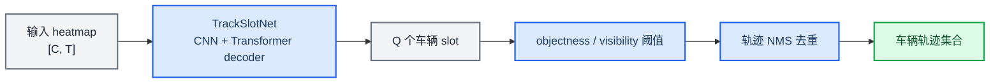
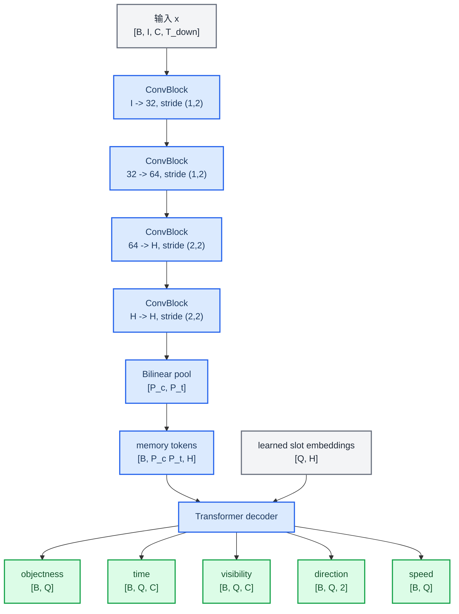
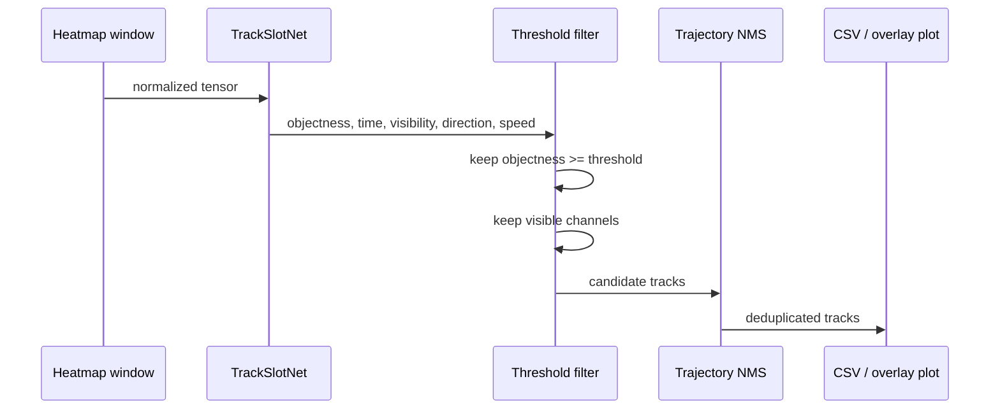
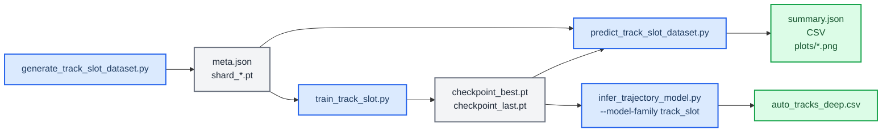

# TrackSlotNet 最新方法完整说明

_面向干净高斯 heatmap 的车辆实例级轨迹识别、计数与可视化方案。_

---

## 方法定位

TrackSlotNet 的目标不是在 `channel x time` 图上做传统图搜索，也不是先找峰再聚类。它把一个窗口内的所有车辆看成一个无序集合，直接用深度网络输出一组车辆 slot。每个 slot 对应一辆候选车，包含这辆车在每个 DAS 通道上的中心时间、可见性、方向、速度和存在概率。

这套方法适合当前数据特性：输入已经是干净的高斯 heatmap，车辆在图上表现为一条条平滑斜线或局部斜线。网络要学的是“哪些点属于同一辆车”，也就是实例级轨迹识别，而不是像素级大 mask 分割。



核心设计点：

- 输入是预处理后的 tensor shard，不在训练时读取 SAC，不在线生成样本
- 输出是固定数量 `Q` 的 slot，但通过 objectness 阈值得到可变车辆数
- 每个 slot 输出紧凑轨迹参数 `[time, visibility, direction, speed]`
- 训练只在 `[Q, GT]` 小矩阵上做 Hungarian matching
- 推理只做阈值和轨迹 NMS，不做图搜索聚类

## 物理信号模型

### DAS channel-time 几何

设 DAS 有 `C` 个通道，通道间距为 `dx`，第 `c` 个通道的位置为：

```math
x_c = c \cdot dx,\quad c=0,1,\dots,C-1
```

最简单的车辆模型是假设车辆以近似恒定速度 `v` 沿光缆方向运动。若用 `eta` 表示方向，`eta=+1` 和 `eta=-1` 分别代表两种行驶方向，则车辆到达通道 `c` 的中心时间可以写成：

```math
\tau(c) = \tau(c_0) + \eta \frac{(c-c_0)dx}{v}
```

这里 `c0` 是参考通道，`\tau(c0)` 是车辆经过参考通道的时间。这个式子解释了为什么理想常速车辆在 heatmap 上是一条斜线：通道位置线性变化，中心时间也线性变化。

在数据生成脚本中，方向用两种距离定义实现：

```math
d_{\text{forward}}(c)=c\,dx
```

```math
d_{\text{reverse}}(c)=(C-1-c)\,dx
```

旧版生成器用入口时间 `t_entry` 得到每个通道的中心时间：

```math
\tau(c)=t_{\text{entry}}+\frac{d(c)}{v}
```

新版生成器默认不再只生成严格直线，而是使用通道段速度剖面积分：

```math
\tau(c+1)=\tau(c)+\frac{dx}{v_c}
```

默认运动模型是：

| 模型 | 默认比例 | 含义 |
| --- | ---: | --- |
| `constant_sparse` | 0.84 | 主体常速，少量随机通道段出现不超过 1% 的局部速度扰动 |
| `smooth_random` | 0.15 | 沿通道缓慢变化的低频随机速度 |
| `stop_go` | 0.01 | 中间短暂停车再启动，作为稀有异常轨迹 |

`constant_sparse` 的局部扰动为：

```math
v_j=v_0(1+\delta_j),\quad \delta_j\sim U(-\delta_{\max},\delta_{\max})
```

默认 `delta_max=0.01`，并且扰动是稀疏事件，不是每个通道段都有噪声。`stop_go` 不用 `v=0` 直接积分，而是在停车通道之后加停车延迟：

```math
\tau(c)=\tau_{\text{base}}(c)+T_{\text{stop}},\quad c>c_{\text{stop}}
```

如果 `\tau(c)` 落在当前窗口 `[0, T_w)` 内，该车辆在通道 `c` 可见；否则不可见：

```math
m(c)=\mathbf{1}[0 \le \tau(c) < T_w]
```

### 高斯 heatmap 观测模型

当前训练数据是干净高斯 heatmap。单辆车在通道 `c`、时间 `t` 上的响应为：

```math
h(c,t)=A\exp\left[-\frac{1}{2}\left(\frac{t-\tau(c)}{\sigma}\right)^2\right]
```

多辆车叠加后，观测 heatmap 为：

```math
x(c,t)=\sum_{i=1}^{G} A_i\exp\left[-\frac{1}{2}\left(\frac{t-\tau_i(c)}{\sigma_i}\right)^2\right]+\epsilon(c,t)
```

其中：

| 符号 | 含义 |
| --- | --- |
| `G` | 当前窗口中的车辆数量 |
| `A_i` | 第 `i` 辆车的高斯幅值 |
| `sigma_i` | 第 `i` 辆车的时间脉宽 |
| `tau_i(c)` | 第 `i` 辆车在通道 `c` 的中心时间 |
| `epsilon(c,t)` | 可选高斯噪声 |

这也是为什么本方法不需要先做像素 mask：对于车辆识别，真正重要的是每条高斯脊线的中心轨迹 `tau_i(c)` 和可见范围 `m_i(c)`。

## 标签定义

每个训练样本包含最多 `G_max` 条 GT 车辆轨迹。第 `g` 条 GT 的标签为：

```text
time[g, c]       normalized center time at channel c
visibility[g, c] 0/1 visible flag at channel c
direction[g]     0/1 direction label
speed[g]         normalized speed
gt_valid[g]      whether this GT slot is active
```

归一化时间标签为：

```math
y^t_g(c)=\frac{\operatorname{round}(\tau_g(c) f_s)}{N_w-1}
```

其中 `f_s` 是原始采样率，`N_w=T_w f_s` 是窗口原始采样点数。速度标签归一化为：

```math
y^s_g=\frac{v_g^{\text{km/h}}}{v_{\text{norm}}}
```

当前默认 `v_norm=150 km/h`。

## 数据生成与预处理

### 专用 shard 数据集

新的训练数据由 `autotrack/dl/generate_track_slot_dataset.py` 直接生成 `.pt` shard：

```text
meta.json
shard_000000.pt
shard_000001.pt
...
```

每个 shard 内部字段：

| 字段 | 形状 | 含义 |
| --- | --- | --- |
| `x` | `[N, in_channels, C, T_down]` | 输入 heatmap tensor |
| `time` | `[N, G, C]` | GT 归一化中心时间 |
| `visibility` | `[N, G, C]` | GT 通道可见性 |
| `direction` | `[N, G]` | GT 方向 |
| `speed` | `[N, G]` | GT 归一化速度 |
| `gt_valid` | `[N, G]` | GT 车辆是否存在 |

这样训练阶段只读取 tensor，不读 SAC，不做在线仿真，训练速度和可复现性都更好。

### 时间降采样

原始窗口长度为 `N_w`，时间降采样步长为 `r`，输入时间长度为：

```math
T_{\text{down}}=\left\lceil \frac{N_w}{r}\right\rceil
```

热力图生成时直接在降采样时间轴上采样高斯脉冲：

```math
t_k = k \frac{r}{f_s},\quad k=0,1,\dots,T_{\text{down}}-1
```

### 鲁棒幅值归一化

输入归一化用两个统计量控制尺度：

```math
s=\max\left(q_{0.995}(|x|), 3\sqrt{\operatorname{mean}(|x|^2)}, 10^{-6}\right)
```

然后进行裁剪和归一化：

```math
\tilde{x}=\frac{\operatorname{clip}(x/s,-\rho,\rho)}{\rho}
```

其中 `rho=clip_ratio`，默认是 `1.35`。如果 `input_mode=raw`，输入只有 `raw` 一个通道；如果 `input_mode=raw_abs`，输入包含 `raw` 和 `abs` 两个通道。

### 并行生成

生成脚本支持 `--workers`。并行单位是 shard，每个 worker 负责独立生成并写入一个 `shard_*.pt` 文件。worker 内部设置 `torch.set_num_threads(1)`，避免多进程和 PyTorch 内部线程互相抢 CPU。

```sh
WORKERS=8 sh generate_track_slot_dataset.sh
```

## 网络结构

TrackSlotNet 在代码中对应 `TrackSlotPredictor`。它由四个部分组成：

1. CNN backbone 从 heatmap 中提取局部时空特征
2. 固定尺度池化把特征压成 token memory
3. Transformer decoder 用 `Q` 个可学习 slot query 读取全局信息
4. 多个 prediction head 输出每个 slot 的车辆属性



### 默认配置

| 参数 | 默认值 | 作用 |
| --- | ---: | --- |
| `n_channels` | 50 | DAS 通道数 |
| `in_channels` | 1 | 输入特征通道，`raw` 为 1，`raw_abs` 为 2 |
| `max_tracks` | 96 | 输出 slot 数 `Q` |
| `hidden_dim` | 128 | Transformer 隐层维度 `H` |
| `num_heads` | 4 | attention head 数 |
| `decoder_layers` | 2 | Transformer decoder 层数 |
| `pooled_channels` | 8 | 池化后的通道 token 数 `P_c` |
| `pooled_time` | 128 | 池化后的时间 token 数 `P_t` |
| `dropout` | 0.1 | decoder dropout |

### 输出参数

对第 `q` 个 slot，网络输出：

```math
\hat{o}_q,\quad \hat{\tau}_{q,c},\quad \hat{l}^{v}_{q,c},\quad \hat{\ell}^{d}_{q},\quad \hat{s}_q
```

含义为：

| 输出 | 代码字段 | 形状 | 含义 |
| --- | --- | --- | --- |
| `hat{o}` | `objectness_logits` | `[B, Q]` | slot 是否是一辆车 |
| `hat{tau}` | `time` | `[B, Q, C]` | 每通道归一化中心时间，经过 sigmoid |
| `hat{l}^v` | `visibility_logits` | `[B, Q, C]` | 每通道是否可见的 logit |
| `hat{ell}^d` | `direction_logits` | `[B, Q, 2]` | 方向分类 |
| `hat{s}` | `speed` | `[B, Q]` | 归一化速度 |

## Slot set prediction 的数学形式

车辆没有天然顺序。GT 的第 0 辆车和第 1 辆车互换后，物理意义完全一样。因此训练不能用固定下标监督，而要先匹配预测 slot 和 GT 车辆。

对一个样本，设预测 slot 数为 `Q`，GT 车辆数为 `G`。构造匹配代价矩阵：

```math
C \in \mathbb{R}^{Q\times G}
```

第 `q` 个预测 slot 和第 `g` 条 GT 车辆的代价为：

```math
C_{qg}=w_t C^t_{qg}+w_v C^v_{qg}+w_o C^o_{qg}+w_d C^d_{qg}+w_s C^s_{qg}
```

当前代码默认权重：

| 权重 | 默认值 | 项 |
| --- | ---: | --- |
| `w_time` | 5.0 | 时间轨迹误差 |
| `w_vis` | 1.0 | 可见性误差 |
| `w_obj` | 0.75 | objectness 奖励 |
| `w_dir` | 0.5 | 方向概率奖励 |
| `w_speed` | 0.25 | 速度误差 |

时间代价只在 GT 可见通道上计算：

```math
C^t_{qg}=
\frac{\sum_c m_g(c)\left|\hat{\tau}_{q,c}-y^t_g(c)\right|}
{\max\left(1,\sum_c m_g(c)\right)}
```

可见性代价为：

```math
C^v_{qg}=\frac{1}{C}\sum_c\left|\sigma(\hat{l}^{v}_{q,c})-m_g(c)\right|
```

objectness、方向和速度项为：

```math
C^o_{qg}=-\sigma(\hat{o}_q)
```

```math
C^d_{qg}=-\operatorname{softmax}(\hat{\ell}^d_q)_{d_g}
```

```math
C^s_{qg}=\left|\hat{s}_q-y^s_g\right|
```

Hungarian matching 求解：

```math
\pi^*=\arg\min_{\pi}\sum_{(q,g)\in\pi} C_{qg}
```

这里只匹配 `Q x G` 的小矩阵，不生成 `[Q, C, T]` 大 mask。对于当前默认 `Q=96`、`G=32~48` 的规模，匹配开销远小于 CNN/Transformer 前向和反向传播。

## 损失函数

匹配完成后，matched slot 作为正样本，未匹配 slot 作为背景样本。总损失为：

```math
\mathcal{L}
=\mathcal{L}_{obj}
+\lambda_t\mathcal{L}_{time}
+\lambda_v\mathcal{L}_{vis}
+\lambda_d\mathcal{L}_{dir}
+\lambda_s\mathcal{L}_{speed}
```

当前默认：

| 项 | 权重 |
| --- | ---: |
| `lambda_t` | 8.0 |
| `lambda_v` | 1.0 |
| `lambda_d` | 0.5 |
| `lambda_s` | 0.5 |

### Objectness loss

objectness 使用 binary cross entropy：

```math
\mathcal{L}_{obj}
=\operatorname{BCEWithLogits}(\hat{o}_q,z_q)
```

其中 `z_q=1` 表示 slot `q` 匹配到某条 GT 车辆，否则 `z_q=0`。未匹配 slot 的权重默认较低：

```math
w_{\text{no-object}}=0.05
```

这样可以避免大量空 slot 主导损失。

### Time loss

时间回归使用 visibility 加权 Smooth L1：

```math
\mathcal{L}_{time}
=\frac{\sum_{(q,g)\in\pi^*}\sum_c m_g(c)\operatorname{SmoothL1}(\hat{\tau}_{q,c},y^t_g(c))}
{\sum_{(q,g)\in\pi^*}\sum_c m_g(c)}
```

不可见通道不参与时间监督。

### Visibility、direction 和 speed loss

可见性使用逐通道 BCE：

```math
\mathcal{L}_{vis}
=\operatorname{BCEWithLogits}(\hat{l}^{v}_{q,c},m_g(c))
```

方向使用交叉熵：

```math
\mathcal{L}_{dir}
=\operatorname{CE}(\hat{\ell}^{d}_{q},d_g)
```

速度使用 Smooth L1：

```math
\mathcal{L}_{speed}
=\operatorname{SmoothL1}(\hat{s}_{q},y^s_g)
```

## 为什么这样能识别不同数量车辆

网络总是输出固定 `Q` 个 slot，但不是每个 slot 都有效。训练时只有匹配到 GT 的 slot 被监督为 objectness=1，其余 slot 被监督为 objectness=0。推理时：

```math
\hat{G}=\sum_{q=1}^{Q}\mathbf{1}[\sigma(\hat{o}_q)\ge \theta_o]
```

也就是说，车辆数量由通过 objectness 阈值的 slot 数决定。只要 `Q` 大于窗口内最大车辆数，模型就可以表示可变车辆数。

同一辆车的轨迹由单个 slot 的 `time[q, :]` 和 `visibility[q, :]` 表示，不需要再把局部峰值聚类成轨迹。

## 推理流程

TrackSlotNet 推理分四步：

1. 将窗口数据预处理成 `[1, in_channels, C, T_down]`
2. 网络输出 `Q` 个 slot
3. 用 objectness 和 visibility 阈值筛选有效轨迹点
4. 对相似轨迹做 NMS 去重



### 阈值筛选

第 `q` 个 slot 只有满足以下条件才保留：

```math
\sigma(\hat{o}_q)\ge \theta_o
```

通道 `c` 上的轨迹点只有满足以下条件才保留：

```math
\sigma(\hat{l}^{v}_{q,c})\ge \theta_v
```

如果保留的通道数小于 `min_visible_channels`，整条 slot 轨迹被丢弃。

### 从归一化时间回到采样点

预测时间先被限制在 `[0,1]`，再映射到原始采样点：

```math
\hat{k}_{q,c}=\operatorname{round}\left(\operatorname{clip}(\hat{\tau}_{q,c},0,1)(N_w-1)\right)
```

对应的秒级时间为：

```math
\hat{t}_{q,c}=\frac{\hat{k}_{q,c}}{f_s}
```

### 轨迹 NMS

两个候选轨迹如果在足够多通道上重叠，并且重叠通道的时间差中位数很小，就认为是重复预测：

```math
\left|\mathcal{C}_a\cap\mathcal{C}_b\right|\ge M
```

```math
\operatorname{median}_{c\in \mathcal{C}_a\cap\mathcal{C}_b}
\left|\hat{k}_{a,c}-\hat{k}_{b,c}\right|\le R
```

其中 `M=dedup_min_overlap_channels`，`R=dedup_tolerance_samples`。重复时保留 `total_score` 更高的轨迹。

## 分割含义

这里的“分割”不是输出每辆车的二维像素 mask，而是输出实例级轨迹分割：

```text
vehicle instance -> slot q
slot q -> visible channels
visible channel c -> center time tau(q,c)
```

因此每辆车的区域可由中心线和可见性恢复。如果后续需要像素级 mask，可以在推理后用预测中心线生成窄带高斯或带状 mask：

```math
M_q(c,t)=\mathbf{1}\left[|\;t-\hat{\tau}_q(c)\;|\le r_t\right]\cdot \mathbf{1}[\hat{m}_q(c)=1]
```

当前训练没有使用这种大 mask，是为了保持训练高效。

## 训练效率分析

这套方法快的原因主要有三个。

| 设计 | 效率收益 |
| --- | --- |
| 训练读 `.pt` shard | 避免训练时解析 SAC 和在线仿真 |
| 每个 slot 输出 `[C]` 时间和可见性 | 避免 `[Q, C, T]` 大 mask |
| Hungarian 只在 `[Q, G]` 上匹配 | 匹配矩阵很小，开销可控 |

假设 `Q=96`、`G=48`、`C=50`、`T_down=24000`：

| 表示方式 | 单样本主要匹配/监督规模 |
| --- | ---: |
| 大 mask `[Q, C, T]` | `96 x 50 x 24000 = 115,200,000` |
| TrackSlot `[Q, G] + [Q, C]` | `96 x 48 + 96 x 50 = 9,408` |

两者不是同一个量级。TrackSlotNet 把监督目标压缩到轨迹参数，所以训练瓶颈主要回到网络前向/反向，而不是实例 mask 匹配。

## 文件与数据流



| 文件 | 作用 |
| --- | --- |
| `autotrack/dl/generate_track_slot_dataset.py` | 生成 TrackSlotNet 专用 tensor shard |
| `autotrack/dl/train_track_slot.py` | 从 shard 训练 TrackSlotNet |
| `autotrack/dl/track_slot_model.py` | 网络、matching、loss、推理、checkpoint |
| `autotrack/dl/predict_track_slot_dataset.py` | 在 shard 上预测、评估并画 overlay 图 |
| `autotrack/dl/plot_track_slot_history.py` | 读取 `train_history.jsonl` 并绘制训练曲线 |
| `generate_track_slot_dataset.sh` | 根目录数据生成快捷脚本 |
| `train_track_slot_cuda.sh` | CUDA 训练快捷脚本 |
| `train_track_slot_cpu.sh` | CPU 训练快捷脚本 |
| `predict_track_slot_dataset.sh` | shard 预测和可视化快捷脚本 |
| `plot_track_slot_history.sh` | 训练历史绘图快捷脚本 |

## 运行方式

### 生成训练数据

```sh
WORKERS=8 sh generate_track_slot_dataset.sh
```

常用环境变量：

| 变量 | 默认值 | 含义 |
| --- | --- | --- |
| `OUT_DIR` | `datasets/track_slot/train` | 输出数据集目录 |
| `NUM_SAMPLES` | `20000` | 样本数 |
| `SHARD_SIZE` | `256` | 每个 shard 样本数 |
| `WINDOW_SECONDS` | `240` | 窗口长度 |
| `TIME_DOWNSAMPLE` | `10` | 时间降采样步长 |
| `VEHICLES_MIN` | `32` | 最少车辆数 |
| `VEHICLES_MAX` | `48` | 最多车辆数 |
| `MOTION_MIX` | `constant_sparse,smooth_random,stop_go` | 运动模型集合 |
| `MOTION_WEIGHTS` | `0.84,0.15,0.01` | 运动模型比例 |
| `CONSTANT_PERTURB_PROB` | `0.05` | 常速模型局部扰动事件概率 |
| `CONSTANT_PERTURB_MAX_FRAC` | `0.01` | 常速局部扰动最大幅度 |
| `SMOOTH_SPEED_MAX_FRAC` | `0.05` | 平滑随机速度最大变化幅度 |
| `STOP_DURATION_MIN_S` | `1.0` | 停车再启动最短停车时间 |
| `STOP_DURATION_MAX_S` | `8.0` | 停车再启动最长停车时间 |
| `WORKERS` | `8` | 并行 shard worker 数 |

### CUDA 训练

```sh
DEVICE=cuda EPOCHS=50 BATCH_SIZE=64 sh train_track_slot_cuda.sh
```

训练输出：

```text
models/track_slot_cuda/checkpoint_last.pt
models/track_slot_cuda/checkpoint_best.pt
models/track_slot_cuda/train_config.json
models/track_slot_cuda/train_history.jsonl
```

绘制训练曲线：

```sh
RUN_DIR=models/track_slot_cuda sh plot_track_slot_history.sh
```

默认输出：

```text
models/track_slot_cuda/history_plots/history_overview.png
models/track_slot_cuda/history_plots/history_loss.png
models/track_slot_cuda/history_plots/history_track_f1.png
models/track_slot_cuda/history_plots/history_plot_summary.json
```

### CPU smoke test

```sh
uv run python -m autotrack.dl.generate_track_slot_dataset \
  --out-dir /tmp/track_slot_data \
  --num-samples 32 \
  --shard-size 16 \
  --window-seconds 10 \
  --time-downsample 20 \
  --workers 2 \
  --overwrite

uv run python -m autotrack.dl.train_track_slot \
  --data-dir /tmp/track_slot_data \
  --out-dir /tmp/track_slot_smoke \
  --device cpu \
  --epochs 1 \
  --batch-size 2
```

### 在 shard 上预测并画图

```sh
MODEL=/tmp/track_slot_smoke/checkpoint_best.pt \
DATA_DIR=/tmp/track_slot_data \
OUT_DIR=/tmp/track_slot_predict \
DEVICE=cpu \
PLOT_SAMPLES=16 \
sh predict_track_slot_dataset.sh
```

输出：

```text
/tmp/track_slot_predict/summary.json
/tmp/track_slot_predict/sample_summary.csv
/tmp/track_slot_predict/predicted_tracks.csv
/tmp/track_slot_predict/ground_truth_tracks.csv
/tmp/track_slot_predict/plots/sample_000000.png
```

overlay 图中：

| 元素 | 含义 |
| --- | --- |
| 灰度背景 | 输入 heatmap |
| 绿色线 | GT 车辆轨迹 |
| 红色线和黄色点 | 网络预测轨迹 |

### 在 SAC 数据上推理

如果有 SAC 数据目录，可以运行：

```sh
uv run python -m autotrack.dl.infer_trajectory_model \
  --model-family track_slot \
  --model models/track_slot_cuda/checkpoint_best.pt \
  --data-folder datasets/test/sim_1001 \
  --out-csv /tmp/track_slot_pred.csv \
  --device cuda \
  --window-start-s 0 \
  --window-seconds 120 \
  --objectness-threshold 0.3 \
  --visibility-threshold 0.3 \
  --min-visible-channels 3
```

注意：这个入口读取的是 SAC 文件夹。如果当前机器没有 `datasets/test/sim_1001`，应优先用 `predict_track_slot_dataset.py` 在 `.pt` shard 上验证训练效果。

## 指标解释

训练和预测脚本会输出以下关键指标：

| 指标 | 含义 |
| --- | --- |
| `loss` | 总损失 |
| `loss_time` | 时间中心线误差损失 |
| `loss_obj` | slot 是否存在的损失 |
| `loss_vis` | 通道可见性损失 |
| `track_precision` | 通过阈值的预测中有多少匹配 GT |
| `track_recall` | GT 车辆中有多少被预测到 |
| `track_f1` | precision 和 recall 的调和平均 |
| `count_mae` | 每个样本车辆数量绝对误差 |
| `count_acc` | 每个样本车辆数量完全正确的比例 |
| `time_mae_norm` | 匹配轨迹的归一化时间误差 |

预测脚本的 `summary.json` 中还有两组计数：

- `aggregate_detection_metrics.pred_count_objectness_only`：只按 objectness 统计的 slot 数
- `filtered_count_metrics.pred_count`：objectness、visibility、`min_visible_channels` 过滤后的最终轨迹数

实际看结果时，建议同时检查 `summary.json` 和 overlay 图。数值指标能说明整体误差，overlay 图能直观看预测线是否贴住高斯脊线。

## 关键超参数

| 参数 | 增大后的效果 | 降低后的效果 |
| --- | --- | --- |
| `max_tracks` | 能表达更多车辆，但 slot 更多 | 更快，但可能装不下所有车辆 |
| `objectness_threshold` | 预测更保守，漏检可能增加 | 预测更多，误检可能增加 |
| `visibility_threshold` | 轨迹点更少更干净 | 轨迹点更多但可能带噪 |
| `min_visible_channels` | 短轨迹更容易被过滤 | 保留短轨迹，但误检风险增加 |
| `time_downsample` | 输入更短更快，但时间分辨率降低 | 时间更细，但显存和计算增加 |
| `hidden_dim` | 表达能力增强 | 更快、更省显存 |
| `pooled_time` | decoder memory 更细 | 更快但可能损失时间细节 |

## 当前方法的边界

TrackSlotNet 的假设是：车辆在输入 heatmap 中已经表现为清晰高斯脊线。如果输入还包含强噪声、断裂、非车辆干扰或大幅偏离训练速度范围，模型需要通过数据生成参数增强或真实标注数据继续训练。

需要特别注意的边界：

- `max_tracks` 必须大于等于窗口内最大车辆数
- 训练集的车辆数量范围、速度范围、脉宽和噪声水平要覆盖实际数据
- 如果输出车辆数偏少，先降低 `objectness_threshold` 和 `visibility_threshold`
- 如果输出轨迹很多重复线，调大 `dedup_tolerance_samples` 或提高阈值
- 当前 track_slot 路径不依赖图搜索聚类，也不输出训练用大 mask

## 与旧方法的区别

| 维度 | 旧图搜索/聚类思路 | TrackSlotNet |
| --- | --- | --- |
| 基本单位 | 局部峰值、边、路径 | 车辆 slot |
| 车辆数量 | 后处理聚类得到 | objectness 阈值得到 |
| 同车识别 | 图搜索或聚类规则 | 网络直接输出同一 slot |
| 训练目标 | 不适用或依赖传统标签 | set prediction |
| 匹配规模 | 容易涉及图或 mask | `[Q, GT]` 小矩阵 |
| 推理后处理 | 图搜索、聚类、路径筛选 | 阈值 + 轨迹 NMS |

本方法的核心变化是把“同一辆车”的判定从后处理规则转移到网络 slot 表示中。网络训练时通过 Hungarian matching 学会把一条完整车辆轨迹压到一个 slot 里，推理时每个高置信 slot 就是一辆车。

## 实现位置

主要实现文件：

- `autotrack/dl/track_slot_model.py`
- `autotrack/dl/generate_track_slot_dataset.py`
- `autotrack/dl/train_track_slot.py`
- `autotrack/dl/predict_track_slot_dataset.py`
- `autotrack/core/trajectory_deep_engine.py`

根目录快捷脚本：

- `generate_track_slot_dataset.sh`
- `train_track_slot_cuda.sh`
- `train_track_slot_cpu.sh`
- `predict_track_slot_dataset.sh`

建议把这份文档作为 TrackSlotNet 的完整方法说明；`docs/track_slot_network.md` 可以保留为短版速查。
