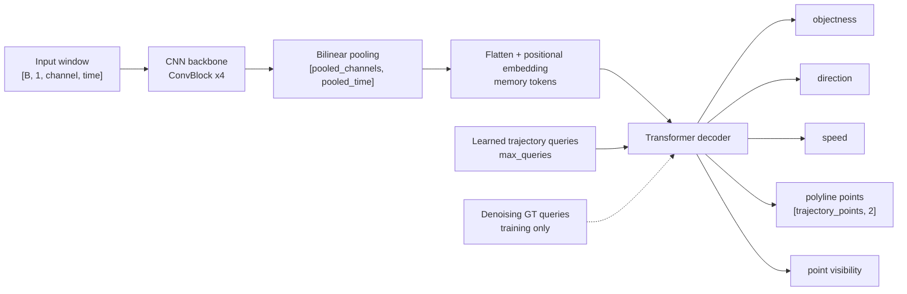

# Trajectory Query Network

本文档总结当前深度学习车辆轨迹提取网络的设计、输入输出、训练方式、loss、指标和推理流程。对应主要实现文件：

- `autotrack/dl/trajectory_set_model.py`
- `autotrack/dl/train_trajectory_online.py`
- `autotrack/dl/train_trajectory_model.py`
- `autotrack/core/trajectory_deep_engine.py`

## 1. 任务定义

当前任务不是图像分割，也不是先检测中心线再聚类，而是 **trajectory set prediction**：

给定一个 DAS 窗口 `[channel, time]`，模型一次性输出不定数量的车辆轨迹。实现上模型始终输出固定数量的 query，例如 `max_queries=128`；每个 query 表示一辆候选车。推理时根据 `objectness` 阈值筛选有效 query，剩下的 query 数量就是窗口中的车辆数量。

每条 query 内部直接输出一组轨迹点：

```text
[(channel_norm, time_norm), ...]
```

所以一个 query 天然对应“一辆车”，不需要后处理再判断哪些点属于同一辆车。

## 2. 总体结构

当前模型不是 UNet，也不是 diffusion。结构更接近 MapTR/DETR 风格：



默认在线训练脚本中的主要参数：

```text
n_channels = 50
window_seconds = 240
fs = 1000
time_downsample = 10
input time length = 240000 / 10 = 24000
input shape = [B, 1, 50, 24000]
max_queries = 128
hidden_dim = 128
decoder_layers = 2
num_heads = 4
pooled_channels = 8
pooled_time = 128
trajectory_points = 32
```

## 3. 输入

原始 DAS 窗口是：

```text
[channel, time_sample]
```

新模型默认只使用 1 个输入通道：

```text
input[0] = clipped normalized raw signal
```

之前的旧模型支持 `raw_abs` 两通道：

```text
input[0] = clipped normalized raw signal
input[1] = clipped normalized abs(signal)
```

但对于当前模拟数据，车辆信号本身就是干净的高斯窗，`abs(signal)` 不提供额外信息。因此新训练默认使用 `raw` 单通道输入，减少输入带宽和第一层卷积计算量。续训旧的 2 通道 checkpoint 时，`INPUT_MODE=auto` 会根据 checkpoint 的 `in_channels=2` 自动保持 `raw_abs`，避免 shape mismatch。

归一化方式使用 robust scale：

```text
scale = max(q99.5(abs(data)), 3 * RMS(abs(data)), 1e-6)
```

然后按 `clip_ratio` 裁剪。默认 `clip_ratio=1.35`。

因此模型实际输入形状是：

```text
[batch, 1, n_channels, n_time_downsampled]
```

默认在线训练中：

```text
[B, 1, 50, 24000]
```

如果加载旧的 2 通道 checkpoint，则输入仍为：

```text
[B, 2, 50, 24000]
```

## 4. Backbone

Backbone 是 4 个卷积块：

```text
ConvBlock(in_channels, 32, stride=(1, 2))
ConvBlock(32, 64, stride=(2, 2))
ConvBlock(64, hidden_dim, stride=(2, 2))
ConvBlock(hidden_dim, hidden_dim, stride=(1, 2))
```

每个 `ConvBlock` 内部是：

```text
Conv2d 3x3
GroupNorm
GELU
Conv2d 3x3
GroupNorm
GELU
```

Backbone 输出后，不直接保留原始尺寸，而是插值到固定大小：

```text
[pooled_channels, pooled_time] = [8, 128]
```

然后 flatten 成 Transformer memory tokens：

```text
memory tokens = 8 * 128 = 1024
memory shape = [B, 1024, hidden_dim]
```

## 5. Transformer Queries

模型有 `max_queries` 个可学习 query embedding：

```text
query_embed: [max_queries, hidden_dim]
```

每个 query 负责预测一辆候选车。默认：

```text
max_queries = 128
```

这解决了车辆数量不固定的问题：模型始终输出 128 条候选轨迹，推理时保留 `objectness` 高的轨迹。

训练时还可以追加 denoising queries：

```text
denoising_queries = 32
dn_point_noise = 0.04
```

Denoising query 是把 GT 轨迹加一点噪声后输入 decoder，要求模型恢复原 GT。它只在训练时使用，推理时不会追加。

## 6. 输出

每个 query 输出：

```text
objectness_logits: [B, Q]
direction_logits:  [B, Q, 2]
speed:             [B, Q]
points:            [B, Q, trajectory_points, 2]
point_valid_logits:[B, Q, trajectory_points]
```

其中：

```text
points[..., 0] = channel_norm, 范围 [0, 1]
points[..., 1] = time_norm,    范围 [0, 1]
```

转换回真实坐标：

```text
ch_idx ~= channel_norm * (n_channels - 1)
t_idx  ~= time_norm * (window_samples - 1)
time_s = t_idx / fs + window_start_s
offset_m = ch_idx * dx_m
```

模型里还保留了旧版本的 dense 输出：

```text
visibility_logits: [B, Q, n_channels]
time:              [B, Q, n_channels]
```

但当前主训练目标是 polyline points。

## 7. 标签格式

离线数据来自 `tracks.json`。每辆车包含多个通道上的真值点：

```text
track_id
ch_idx
offset_m
time_s
t_idx
direction
speed_kmh
```

训练时先构造成 dense 格式：

```text
time[vehicle, channel]       = normalized time
visibility[vehicle, channel] = 0/1
direction[vehicle]           = forward/reverse
speed[vehicle]               = speed_kmh / speed_norm_kmh
```

再转换为固定长度 polyline：

```text
points[vehicle, trajectory_points, 2]
point_valid[vehicle, trajectory_points]
```

如果一辆车可见通道数大于 `trajectory_points`，会均匀采样到固定点数；如果小于固定点数，后面点用 `point_valid=0` 标记无效。

训练 batch 现在会把不同窗口中不定数量的车辆 padding 成固定 tensor：

```text
time         [B, G, C]
visibility   [B, G, C]
points       [B, G, P, 2]
point_valid  [B, G, P]
direction    [B, G]
speed        [B, G]
gt_valid     [B, G]
```

其中 `G` 是当前 batch 中最大 GT 车辆数，空槽由 `gt_valid=False` 屏蔽。训练循环会把这整套 target tensor 一次性搬到 GPU，避免 loss 里反复处理 Python list/dict。

## 8. Matching

训练时不知道哪个 query 对应哪辆 GT 车，所以需要 matching。

默认使用 Hungarian matching：

```text
matcher = hungarian
```

匹配 cost：

```text
cost =
  5.0  * point_cost
+ 1.0  * valid_cost
+ 0.5  * direction_cost
+ 0.25 * speed_cost
+ 0.75 * objectness_cost
```

也提供近似 GPU greedy matcher：

```sh
MATCHER=greedy sh train_online.sh
```

`hungarian` 更精确，但会把 cost matrix 拷到 CPU 调 SciPy，速度慢一些；`greedy` 更快，但匹配质量可能略差。

当 target 是 batched tensor 且 `MATCHER=greedy` 时，训练 loss 使用 batched greedy matching：一次性构造 `[B, Q, G]` cost，在 GPU 上对整个 batch 做近似一对一匹配。这样比逐样本 Python loop 更适合大 batch 训练。

## 9. Loss

总 loss：

```text
loss =
  loss_obj
+ 8.0 * loss_point
+ 1.0 * loss_valid
+ 0.5 * loss_dir
+ 0.5 * loss_speed
+ duplicate_loss_weight * loss_duplicate
+ denoising_loss_weight * loss_dn
+ line_loss_weight * loss_line
+ slope_smooth_loss_weight * loss_slope_smooth
```

各项含义：

```text
loss_obj
    query 是否有车，BCE。

loss_point
    匹配 query 与 GT polyline 点的 Smooth L1。

loss_valid
    每个 polyline 点是否有效，BCE。

loss_dir
    正向/反向方向分类，Cross Entropy。

loss_speed
    归一化速度回归，Smooth L1。

loss_duplicate
    惩罚多个高 objectness query 预测到同一辆车附近。当前实现已经批量化，
    不再按 batch 逐个 query pair 循环。

loss_dn
    denoising queries 的辅助恢复 loss。

loss_line
    轨迹整体接近直线的软约束。当前实现按匹配轨迹 batch tensor 计算。

loss_slope_smooth
    允许轻微变速，但惩罚相邻局部斜率突变。当前实现按匹配轨迹 batch tensor 计算。
```

默认在线训练脚本中的相关权重：

```text
NO_OBJECT_WEIGHT = 0.3
DUPLICATE_LOSS_WEIGHT = 0.2
DENOISING_LOSS_WEIGHT = 1.0
LINE_LOSS_WEIGHT = 1.0
SLOPE_SMOOTH_LOSS_WEIGHT = 0.25
```

## 10. 在线训练数据

在线训练不写 SAC、不读 SAC，而是在内存中直接合成窗口：

```text
OnlineSyntheticTrajectoryDataset
```

特点：

```text
固定样本池 + 每个 epoch shuffle
```

也就是说：

```text
steps_per_epoch = 固定样本池大小
```

默认：

```text
STEPS_PER_EPOCH = 10000
```

开启 cache 后，启动时会先生成完整样本池并放在内存中：

```text
CACHE_DATASET = 1
CACHE_DTYPE = float16
CACHE_BUILD_WORKERS = 64
NUM_WORKERS = 0
```

这样训练阶段不会每个 epoch 重新生成数据，也不会从磁盘读 SAC。

## 11. 训练命令

常规在线训练：

```sh
sh train_online.sh
```

断点续训：

```sh
RESUME=models/trajectory_query_online_v1_cuda/checkpoint_last.pt sh train_online.sh
```

如果 checkpoint 的 `epoch=200`，且 `EPOCHS=400`，则继续训练：

```text
201 -> 400
```

只加载模型、不加载 optimizer：

```sh
RESUME=models/trajectory_query_online_v1_cuda/checkpoint_last.pt RESUME_MODEL_ONLY=1 sh train_online.sh
```

用旧的 2 通道 checkpoint 初始化新的 1 通道 raw 网络：

```sh
RESUME=models/trajectory_query_online_v1_cuda/checkpoint_last.pt INPUT_MODE=raw sh train_online.sh
```

这种模式会把旧第一层卷积的 raw 通道权重迁移到新模型，丢弃旧的 `abs(signal)` 通道。因为第一层参数形状已经改变，optimizer state 不会加载，会从新的 AdamW 状态继续训练。

离线 SAC 数据训练：

```sh
sh train.sh
```

## 12. Checkpoint 与日志

输出目录默认：

```text
models/trajectory_query_online_v1_cuda/
```

主要文件：

```text
checkpoint_last.pt
    最近一次保存的模型，包含 model_state、optimizer_state、epoch、metrics。

checkpoint_best.pt
    当前历史最好模型。

train_config.json
    本次训练配置。

train_history.jsonl
    每个 epoch 一行的训练/验证历史记录。

prediction_plots/epoch_XXXX.png
    周期性预测可视化图。
```

查看 checkpoint epoch：

```sh
.venv/bin/python -c 'import torch; ck=torch.load("models/trajectory_query_online_v1_cuda/checkpoint_last.pt", map_location="cpu", weights_only=False); print(ck["epoch"]); print(ck.get("metrics", {}))'
```

## 13. 指标

除了 loss，训练会记录车辆级指标：

```text
track_precision
    预测出来的车辆中，有多少条是真车。

track_recall
    GT 车辆中，有多少条被预测出来。

track_f1
    precision 和 recall 的综合指标，建议重点看。

count_mae
    当前窗口预测车辆数与真实车辆数的平均绝对误差。

count_acc
    车辆数量完全预测正确的窗口比例。

point_mae_norm
    匹配轨迹点的归一化坐标误差。

time_mae_norm
    匹配轨迹点的归一化时间误差。
```

这些不是分类 ACC，也不是图像分割 IoU。因为模型输出的是一组车辆轨迹，车辆级 precision/recall/F1 更合理。

相关阈值：

```text
METRIC_OBJECTNESS_THRESHOLD = 0.5
METRIC_POINT_THRESHOLD = 0.05
```

## 14. 推理流程

推理时：

1. 读取 SAC 窗口。
2. 构造 raw 单通道输入；旧 2 通道 checkpoint 会自动使用 `[raw, abs]`。
3. 模型输出所有 query。
4. 保留 `objectness > threshold` 的 query。
5. 对每条 query 保留有效 polyline 点。
6. 将归一化 `(channel, time)` 转成真实 `ch_idx / t_idx / time_s / offset_m`。
7. 可做局部峰值 refine，提高时间坐标准确度。
8. 输出现有 `Track/TrackPoint`，GUI 和 CSV 导出复用旧流程。

推理命令示例：

```sh
sh predict.sh
```

或者直接：

```sh
uv run python -m autotrack.dl.infer_trajectory_model \
  --data-folder datasets/test/sim_1001 \
  --model models/trajectory_query_online_v1_cuda/checkpoint_best.pt \
  --device auto \
  --window-start-s 0 \
  --window-seconds 120 \
  --out-csv datasets/test/sim_1001/auto_tracks_deep.csv
```

## 15. 当前优缺点

优点：

```text
1. 不需要预先知道窗口里有多少车。
2. 每个 query 天然是一辆车，点归属明确。
3. 输出是坐标点，容易转成 Track/TrackPoint。
4. 支持半截车，通过 point_valid 表示可见点。
5. line/slope loss 符合车辆大多近似匀速直线的先验。
```

主要瓶颈：

```text
1. Hungarian matching 仍然有 CPU 同步开销。
2. loss 里还有部分 Python 循环。
3. 240 s 窗口 + 50 通道 + 1000 Hz 原始采样导致输入时间轴很长。
4. 训练速度较慢，但目前效果已经明显可用。
```

可选提速方向：

```text
1. 继续优化 matching，减少 CPU 同步。
2. 将 line/slope/duplicate loss 尽量批量化。
3. 在保证效果的前提下尝试 MATCHER=greedy。
4. 使用更高效的 backbone 或更小 pooled_time。
5. 多 GPU 或梯度累积。
```
